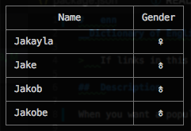

#	enn
__Dictionary of English Names__

>	If links in this document not avaiable, please access [README on GitHub](./README.md) directly.

##  Description

When you want a popular English name, __enn__ is helpful.

##	Table of Contents

* [Links](#links)
* [Get Started](#get-started)

##	Links

*	[CHANGE LOG](./CHANGELOG.md)
*	[Homepage](https://github.com/YounGoat/nodejs.n9)

##	Get Started

```bash
# Install the package globally.
npm install -g enn

# Run it.
enn --name J*
```

The following is some example output of command `enn`:  
